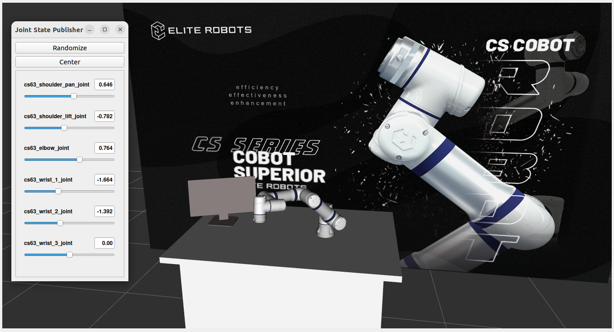
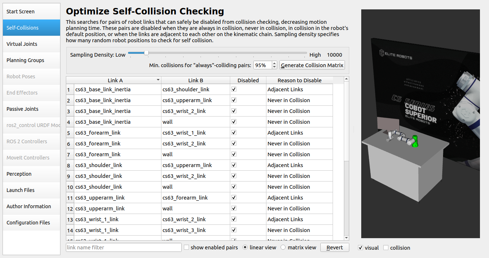
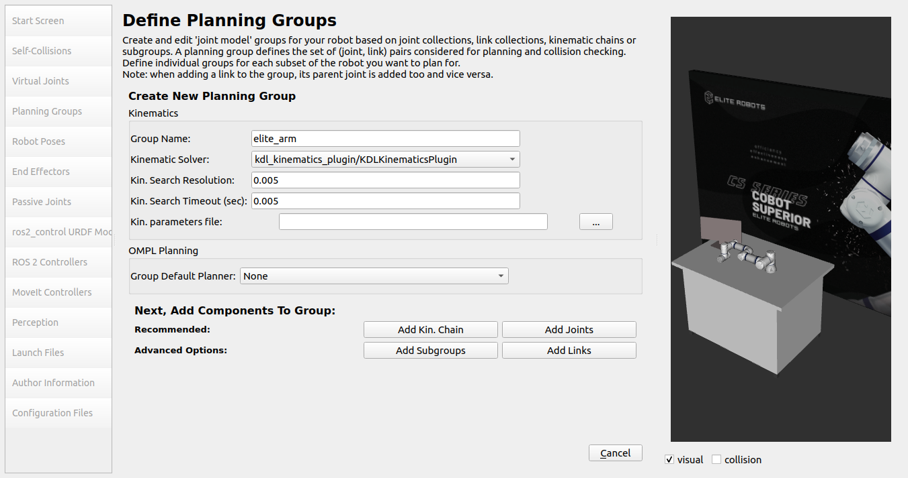
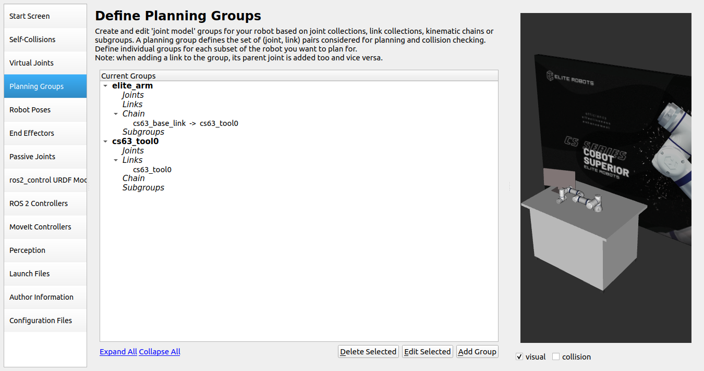
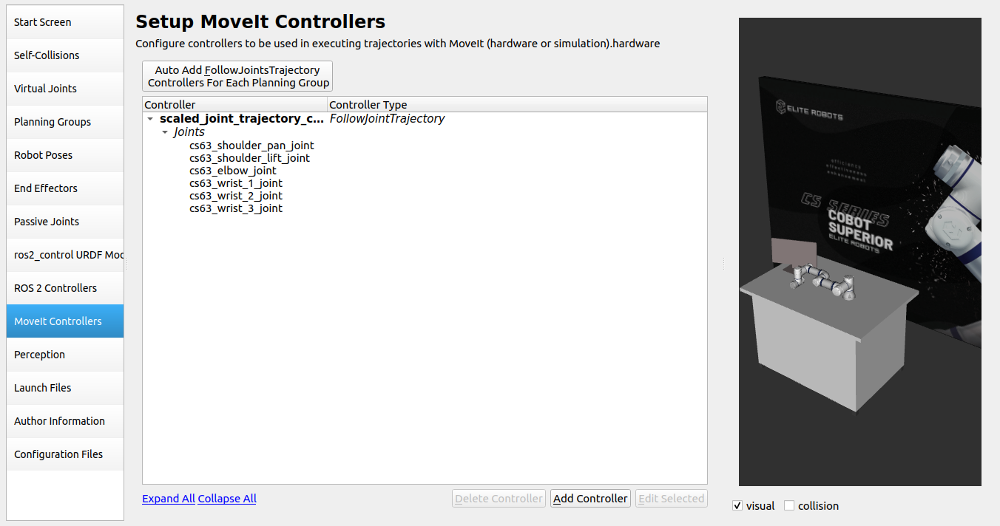

[English tutorials](./ELITE Robots ROS tutorials.md)

# ELITE Robots ROS2 教程

这些教程应该能帮助用户运行他们的自定义用例。以下内容参考UR机器人 ROS2 教程以及 MoveIt2 教程，感谢开发者们对开源世界的贡献。

## 示例教程

### 自定义工作单元

以下是将 **Elite CS系列机械臂** 集成到自定义工作区的示例。该示例将构建一个自定义的工作单元描述，启动驱动程序并创建一个**MoveIt2**配置，以便使用**MoveIt2**进行轨迹规划。

请参阅[软件包的源代码](https://github.com/Elite-Robots/Elite_Robots_CS_Ros2_Tutorials)以获取与此示例相关的所有文件。

### 开始使用：

#### 1. 组装URDF
[eli_cs_robot_description](https://github.com/Elite-Robots/Elite_Robots_CS_ROS2_Driver/tree/main/eli_cs_robot_description) 软件包提供了宏文件，以生成一个Elite Robots机械臂实例。该教程将使用它来创建一个带有 **Elite cs63** 的自定义工作单元。

- ##### 工作单元描述
     ```xml
     <?xml version="1.0"?>
     <robot name="my_elite_robot_cell" xmlns:xacro="http://ros.org/wiki/xacro">
     
       <xacro:include filename="$(find my_elite_robot_cell_description)/urdf/my_elite_robot_cell_macro.xacro"/>
     
       <xacro:arg name="cs_type" default="cs63"/>
       <xacro:arg name="joint_limits_parameters_file" default="$(find eli_cs_robot_description)/config/$(arg cs_type)/joint_limits.yaml"/>
       <xacro:arg name="kinematics_parameters_file" default="$(find eli_cs_robot_description)/config/$(arg cs_type)/default_kinematics.yaml"/>
       <xacro:arg name="physical_parameters_file" default="$(find eli_cs_robot_description)/config/$(arg cs_type)/physical_parameters.yaml"/>
       <xacro:arg name="visual_parameters_file" default="$(find eli_cs_robot_description)/config/$(arg cs_type)/visual_parameters.yaml"/>
     
       <link name="world"/>
       <!--This will create the scene where the robot is located in-->
       <xacro:my_elite_robot_cell
         parent="world"
         cs_type="$(arg cs_type)"
         joint_limits_parameters_file="$(arg joint_limits_parameters_file)"
         kinematics_parameters_file="$(arg kinematics_parameters_file)"
         physical_parameters_file="$(arg physical_parameters_file)"
         visual_parameters_file="$(arg visual_parameters_file)"
         >
           <origin xyz="0 0 1" rpy="0 0 0" />
       </xacro:my_elite_robot_cell>
     
     </robot>
     ```

     让我们来拆解一下：

     首先，我们需要 **include** 宏，以生成我们的自定义工作单元：
     
     ```xml
       <xacro:include filename="$(find my_elite_robot_cell_description)/urdf/my_elite_robot_cell_macro.xacro"/>
     ```

     这行代码只是加载了用于生成机器人工作单元的宏。

     我们需要为工作单元提供一些参数，以便对机械臂进行参数化。因此，我们需要声明必须传递给宏的参数。

     ```xml
       <xacro:arg name="cs_type" default="cs63"/>
       <xacro:arg name="joint_limits_parameters_file" default="$(find eli_cs_robot_description)/config/$(arg cs_type)/joint_limits.yaml"/>
       <xacro:arg name="kinematics_parameters_file" default="$(find eli_cs_robot_description)/config/$(arg cs_type)/default_kinematics.yaml"/>
       <xacro:arg name="physical_parameters_file" default="$(find eli_cs_robot_description)/config/$(arg cs_type)/physical_parameters.yaml"/>
       <xacro:arg name="visual_parameters_file" default="$(find eli_cs_robot_description)/config/$(arg cs_type)/visual_parameters.yaml"/>
     ```

     工作空间宏包含工作单元中的所有项目，包括机器人机械臂。如果对编写 URDF 不太熟悉，建议参考此[教程](https://docs.ros.org/en/humble/Tutorials/Intermediate/URDF/URDF-Main.html)。该宏的内容是通过以下方式生成的：

     ```xml
       <link name="world"/>
       <!--This will create the scene where the robot is located in-->
       <xacro:my_elite_robot_cell
         parent="world"
         cs_type="$(arg cs_type)"
         joint_limits_parameters_file="$(arg joint_limits_parameters_file)"
         kinematics_parameters_file="$(arg kinematics_parameters_file)"
         physical_parameters_file="$(arg physical_parameters_file)"
         visual_parameters_file="$(arg visual_parameters_file)"
         >
           <origin xyz="0 0 1" rpy="0 0 0" />
       </xacro:my_elite_robot_cell>
     ```

     到这里，创建了一个 **world** 连杆，并且机器人工作单元是相对于 **world**  连杆创建的。

- ##### 工作单元宏
     工作单元宏的定义方式如下：

     ```xml
     <?xml version="1.0"?>
     <robot xmlns:xacro="http://ros.org/wiki/xacro">
       <xacro:include filename="$(find eli_cs_robot_description)/urdf/cs_macro.xacro"/>
     
       <xacro:macro name="my_elite_robot_cell" params="
         parent
         *origin
         cs_type
         joint_limits_parameters_file
         kinematics_parameters_file
         physical_parameters_file
         visual_parameters_file
         ">
     
         <joint name="table_base_joint" type="fixed">
           <xacro:insert_block name="origin" />
           <parent link="${parent}" />
           <child link="table" />
         </joint>
     
         <link name="table">
           <visual>
             <geometry>
               <mesh filename="package://my_elite_robot_cell_description/meshes/table.dae"/>
             </geometry>
             <origin rpy="0 0 0" xyz="0.75 0.5 -1"/>
           </visual>
           <collision>
             <geometry>
               <mesh filename="package://my_elite_robot_cell_description/meshes/table.dae"/>
             </geometry>
             <origin rpy="0 0 0" xyz="0.75 0.5 -1"/>
           </collision>
         </link>
     
         <link name="monitor">
           <visual>
             <geometry>
               <mesh filename="package://my_elite_robot_cell_description/meshes/monitor.dae"/>
             </geometry>
           </visual>
           <collision>
             <geometry>
               <mesh filename="package://my_elite_robot_cell_description/meshes/monitor.dae"/>
             </geometry>
           </collision>
         </link>
         <joint name="base_to_monitor" type="fixed">
           <parent link="table"/>
           <child link="monitor"/>
           <origin xyz="0.2 0.6 0"/>
         </joint>
     
         <material name="white">
           <color rgba="1 1 1 1"/>
         </material>
     
         <link name="wall">
           <visual>
             <geometry>
               <mesh filename="package://my_elite_robot_cell_description/meshes/wall.dae"/>
             </geometry>
           </visual>
           <collision>
             <geometry>
               <box size="4.44 0.1 2.5"/>
             </geometry>
           </collision>
         </link>
         <joint name="base_to_wall" type="fixed">
           <parent link="table"/>
           <child link="wall"/>
           <origin xyz="1.25 1.5 0.5"/>
         </joint>
     
         <link name="robot_mount"/>
         <joint name="base_to_robot_mount" type="fixed">
           <parent link="table"/>
           <child link="robot_mount"/>
           <origin xyz="1.0 0.5 0" rpy="0 0 0" />
         </joint>
     
         <!--This will create the specific robot-->
         <xacro:cs_robot
           name="${cs_type}"
           tf_prefix="${cs_type}_"
           parent="robot_mount"
           joint_limits_parameters_file="${joint_limits_parameters_file}"
           kinematics_parameters_file="${kinematics_parameters_file}"
           physical_parameters_file="${physical_parameters_file}"
           visual_parameters_file="${visual_parameters_file}"
           generate_ros2_control_tag="false"
         >
           <origin xyz="0 0 0" rpy="0 0 0" />
         </xacro:cs_robot>
       </xacro:macro>
     
     </robot>
     ```

     这个宏提供了一个自定义工作单元的示例。具体使用时的工作区可能会有所不同，可随意修改 URDF 中这部分内容以匹配使用场景中的配置。在本例中，工作区包含一张位于墙前、带有显示器的桌子，以及安装在桌子上的 **cs63** 机械臂。

     请确保自定义工作单元包含传递给 **cs_robot** 宏的父连杆。在本例中，我们选择创建一个名为 **robot_mount** 的连杆。

     ```xml
         <link name="robot_mount"/>
         <joint name="base_to_robot_mount" type="fixed">
           <parent link="table"/>
           <child link="robot_mount"/>
           <origin xyz="1.0 0.5 0" rpy="0 0 0" />
         </joint>
     ```

     之后便能够通过调用这个宏来创建实际 **机器人机械臂** 了。

     ```xml
         <xacro:cs_robot
           name="${cs_type}"
           tf_prefix="${cs_type}_"
           parent="robot_mount"
           joint_limits_parameters_file="${joint_limits_parameters_file}"
           kinematics_parameters_file="${kinematics_parameters_file}"
           physical_parameters_file="${physical_parameters_file}"
           visual_parameters_file="${visual_parameters_file}"
         >
           <origin xyz="0 0 0" rpy="0 0 0" />
         </xacro:ur_robot>
     ```

     请注意，**origin** 参数的传递方式与其他参数不同。

     在测试代码之前，必须构建并加载（**source**） **Colcon** 工作空间。

     ```bash
     #cd to your colcon workspace root
     cd ~/colcon_ws
     
     #source and build your workspace
     colcon build
     source install/setup.bash
     ```
     
     我们可以通过运行以下命令来查看我们自定义的工作空间：

     ```bash
     #launch rviz
     ros2 launch my_elite_robot_cell_description view_robot.launch.py
     ```

     使用 **joint_state_puplisher_gui** 的滑块来移动虚拟机器人。此时的效果应如下：
     
     


#### 2. 启动 eli_cs_robot_driver
在上一章节中，我们构建了一个包含机器人在内的自定义场景描述。为了使该描述能在 **ros2_control** 中使用（从而供 **eli_cs_robot_driver** 调用），我们需要添加控制信息。同时，我们还将添加一个自定义启动文件以启动我们的演示程序。

为此，我们将生成一个名为 **my_elite_robot_cell_control** 的新包。

- ##### 使用 ros2_control 标签创建描述
     第一步，创建一个包含控制指令的描述文件：

     ```xml
     <?xml version="1.0"?>
     <robot name="my_elite_robot_cell" xmlns:xacro="http://ros.org/wiki/xacro">
     
       <!--First, include the macro from our custom description-->
       <xacro:include filename="$(find my_elite_robot_cell_description)/urdf/my_elite_robot_cell_macro.xacro"/>
       <!--The eli_cs_robot_description package already provides a control tag for the ELITE arm, we can directly include-->
       <xacro:include filename="$(find eli_cs_robot_description)/urdf/cs.ros2_control.xacro"/>
     
       <!--We need to specify the arguments used for parametrizing our description-->
       <!--Create a folder for wanted cs_type and copy those files from eli_cs_robot_description package in there; copied only cs63 files -->
       <!--You could as well point to eli_cs_robot_description but this way you make sure you use the same files as start_robot.launch.py which searches in runtime_config_package for joint_limits.yaml, physical_parameters.yaml, visual_parameters.yaml and in description_package for default_kinematics.yaml (last one can be overwritten)-->
       <xacro:arg name="cs_type" default="cs63"/>
       <xacro:arg name="joint_limit_params" default="$(find my_elite_robot_cell_control)/config/$(arg cs_type)/joint_limits.yaml"/>
       <xacro:arg name="kinematics_params" default="$(find my_elite_robot_cell_control)/config/$(arg cs_type)/default_kinematics.yaml"/>
       <xacro:arg name="physical_params" default="$(find my_elite_robot_cell_control)/config/$(arg cs_type)/physical_parameters.yaml"/>
       <xacro:arg name="visual_params" default="$(find my_elite_robot_cell_control)/config/$(arg cs_type)/visual_parameters.yaml"/>
     
       <xacro:arg name="robot_ip" default="0.0.0.0"/>
       <xacro:arg name="local_ip" default="0.0.0.0"/>
       <xacro:arg name="headless_mode" default="false" />
       <xacro:arg name="cs_script_filename" default="$(find eli_cs_robot_driver)/resources/external_control.script"/>
       <xacro:arg name="cs_output_recipe_filename" default="$(find eli_cs_robot_driver)/resources/output_recipe.txt"/>
       <xacro:arg name="cs_input_recipe_filename" default="$(find eli_cs_robot_driver)/resources/input_recipe.txt"/>
       <xacro:arg name="use_fake_hardware" default="false" />
       <xacro:arg name="fake_sensor_commands" default="false" />
       <!--find hash_kinematics in kinematics_params-->
       <xacro:property name="kinematics_params_file" value="$(arg kinematics_params)"/>
     
     
       <link name="world" />
     
       <!--Create the scene description including the robot-->
       <xacro:my_elite_robot_cell
         parent="world"
         cs_type="$(arg cs_type)"
         joint_limits_parameters_file="$(arg joint_limit_params)"
         kinematics_parameters_file="$(arg kinematics_params)"
         physical_parameters_file="$(arg physical_params)"
         visual_parameters_file="$(arg visual_params)"
       >
         <origin xyz="0 0 1" rpy="0 0 0" />
       </xacro:my_elite_robot_cell>
     
     
       <!--Create the control tag for the ELITE robot-->
       <xacro:cs_ros2_control
         name="$(arg cs_type)"
         tf_prefix="$(arg cs_type)_"
         robot_ip="$(arg robot_ip)"
         local_ip="$(arg local_ip)"
         script_filename="$(arg cs_script_filename)"
         output_recipe_filename="$(arg cs_output_recipe_filename)"
         input_recipe_filename="$(arg cs_input_recipe_filename)"
         use_fake_hardware="$(arg use_fake_hardware)"
         fake_sensor_commands="$(arg fake_sensor_commands)"
         headless_mode="$(arg headless_mode)"
       />
     
       <!--If you had more controlled devices in your description, e.g. a gripper, you can add another ros2_control tag here-->
     
     </robot>
     ```

     这个 URDF 与之前组装的非常相似。我们只需要包含 **ros2_control** 宏即可。

     ```xml
       <xacro:include filename="$(find eli_cs_robot_description)/urdf/cs.ros2_control.xacro"/>
     ```

     定义需要传递给宏的必要参数:

     ```xml
       <xacro:arg name="robot_ip" default="0.0.0.0"/>
       <xacro:arg name="local_ip" default="0.0.0.0"/>
       <xacro:arg name="headless_mode" default="false" />
       <xacro:arg name="cs_script_filename" default="$(find eli_cs_robot_driver)/resources/external_control.script"/>
       <xacro:arg name="cs_output_recipe_filename" default="$(find eli_cs_robot_driver)/resources/output_recipe.txt"/>
       <xacro:arg name="cs_input_recipe_filename" default="$(find eli_cs_robot_driver)/resources/input_recipe.txt"/>
       <xacro:arg name="use_fake_hardware" default="false" />
       <xacro:arg name="fake_sensor_commands" default="false" />
     ```

     然后通过提供所有指定的参数来调用该宏 **cs_ros2_control** 。

     ```xml
       <xacro:cs_ros2_control
         name="$(arg cs_type)"
         tf_prefix="$(arg cs_type)_"
         robot_ip="$(arg robot_ip)"
         local_ip="$(arg local_ip)"
         script_filename="$(arg cs_script_filename)"
         output_recipe_filename="$(arg cs_output_recipe_filename)"
         input_recipe_filename="$(arg cs_input_recipe_filename)"
         use_fake_hardware="$(arg use_fake_hardware)"
         fake_sensor_commands="$(arg fake_sensor_commands)"
         headless_mode="$(arg headless_mode)"
       />
     ```

- ##### 提取标定数据
     一个非常重要的步骤是提取机器人的特定标定信息，并将其保存到我们的工作单元启动包中。具体的标定数据可通过 [eli_cs_robot_calibration](https://github.com/SupermanOfHeiLinPu/Elite_Robots_CS_ROS2_Driver/tree/main/eli_cs_robot_calibration) 节点获得真实机器人的标定数据。现在，我们只是复制了 **CS63** 的默认标定信息。

     ```bash
     cp $(ros2 pkg prefix eli_cs_robot_description)/share/eli_cs_robot_description/config/cs63/default_kinematics.yaml my_elite_robot_cell_control/config/my_elite_robot_calibration.yaml
     ```

- ##### 创建 start_robot 启动文件
     **start_robot** 启动文件包含了带有正确描述文件和前缀设置的 **elite_control.launch.py** 启动文件。
   
     ```python
     from launch_ros.substitutions import FindPackageShare
     from launch import LaunchDescription
     from launch.actions import DeclareLaunchArgument, IncludeLaunchDescription
     from launch.launch_description_sources import PythonLaunchDescriptionSource
     from launch.substitutions import (
         LaunchConfiguration,
         PathJoinSubstitution,
     )
     
     
     def generate_launch_description():
         # declare arguments
         declared_arguments = []
         declared_arguments.append(
             DeclareLaunchArgument(
                 "cs_type",
                 description="Type/series of used ELITE robot.",
                 choices=[
                     "cs63",
                     "cs66",
                     "cs612",
                     "cs616",
                     "cs620",
                     "cs625",
                 ],
                 default_value="cs63",
             )
         )
         declared_arguments.append(
             DeclareLaunchArgument(
                 "robot_ip",
                 default_value="192.168.51.146",  # put your robot's IP address here
                 description="IP address by which the robot can be reached.",
             )
         )
         declared_arguments.append(
             DeclareLaunchArgument(
                 "local_ip",
                 default_value="192.168.51.9",  # put your current local IP address here
                 description="Current local IP address.",
             )
         )
         declared_arguments.append(
             DeclareLaunchArgument("launch_rviz", default_value="true", description="Launch RViz?")
         )
         declared_arguments.append(
             DeclareLaunchArgument(
                 "use_fake_hardware",
                 default_value="false",
                 description="Start robot with fake hardware mirroring command to its states.",
             )
         )
         declared_arguments.append(
             DeclareLaunchArgument(
                 "fake_sensor_commands",
                 default_value="false",
                 description="Enable fake command interfaces for sensors used for simple simulations. "
                 "Used only if 'use_fake_hardware' parameter is true.",
             )
         )
         declared_arguments.append(
             DeclareLaunchArgument(
                 "description_package",
                 default_value="my_elite_robot_cell_control",
                 description="description package",
             )
         )
         declared_arguments.append(
             DeclareLaunchArgument(
                 "description_file",
                 default_value="my_elite_robot_cell_controlled.urdf.xacro",
                 description="URDF/XACRO description file with the robot.",
             )
         )
         declared_arguments.append(
             DeclareLaunchArgument(
                 "kinematics_params_file",
                 default_value=PathJoinSubstitution(
                     [
                         FindPackageShare("my_elite_robot_cell_control"),
                         "config",
                         "my_elite_robot_calibration.yaml",
                     ]
                 ),
                 description="The calibration configuration of the actual robot used.",
             )
         )
         declared_arguments.append(
             DeclareLaunchArgument(
                 "initial_joint_controller",
                 default_value="scaled_joint_trajectory_controller",
                 description="Initially loaded robot controller.",
                 choices=[
                     "scaled_joint_trajectory_controller",
                     "joint_trajectory_controller",
                     "forward_velocity_controller",
                     "forward_position_controller",
                 ],
             )
         )
         declared_arguments.append(
             DeclareLaunchArgument(
                 "activate_joint_controller",
                 default_value="true",
                 description="Activate loaded joint controller.",
             )
         )
         declared_arguments.append(
             DeclareLaunchArgument(
                 "headless_mode",
                 default_value="false",
                 description="Enable headless mode for robot control",
             )
         )
     
         # initialize arguments
         cs_type = LaunchConfiguration("cs_type")
         robot_ip = LaunchConfiguration("robot_ip")
         local_ip = LaunchConfiguration("local_ip")
         launch_rviz = LaunchConfiguration("launch_rviz")
         use_fake_hardware = LaunchConfiguration("use_fake_hardware")
         fake_sensor_commands = LaunchConfiguration("fake_sensor_commands")
         controllers_file = LaunchConfiguration("controllers_file")
         description_package = LaunchConfiguration("description_package")
         description_file = LaunchConfiguration("description_file")
         kinematics_params_file = LaunchConfiguration("kinematics_params_file")
         initial_joint_controller = LaunchConfiguration("initial_joint_controller")
         activate_joint_controller = LaunchConfiguration("activate_joint_controller")
         headless_mode = LaunchConfiguration("headless_mode")
     
         base_launch = IncludeLaunchDescription(
             PythonLaunchDescriptionSource(
                 [
                     PathJoinSubstitution([FindPackageShare("eli_cs_robot_driver"), "launch"]),
                     "/elite_control.launch.py",
                 ]
             ),
             launch_arguments={
                 "cs_type": cs_type,
                 "robot_ip": robot_ip,
                 "local_ip": local_ip,
                 "tf_prefix": [LaunchConfiguration("cs_type"), "_"],
                 "launch_rviz": launch_rviz,
                 "use_fake_hardware": use_fake_hardware,
                 "fake_sensor_commands": fake_sensor_commands,
                 "description_package": description_package,
                 "description_file": description_file,
                 "kinematics_params_file": kinematics_params_file,
                 "initial_joint_controller": initial_joint_controller,
                 "activate_joint_controller": activate_joint_controller,
                 "headless_mode": headless_mode,
             }.items(),
         )
     
         return LaunchDescription(declared_arguments + [base_launch])
     ```

     有了这些，我们就可以使用以下命令来启动机器人：

     ```bash
     ros2 launch my_elite_robot_cell_control start_robot.launch.py headless_mode:=true
     ```

     注意，使用时要记得将对应的 **机器人IP** 与 **本地IP** 进行更改，对应的 **机器人类型** 也需要根据实际机型进行替换。 **headless_mode** 可以选择设置为true，减少对示教器的操作与依赖。当多个节点都可能打开rviz时，可以将 **launch_rviz** 设置为false，减少终端性能的消耗。

- ##### 测试所有功能
     在测试代码之前，必须构建并加载（**source**） **Colcon** 工作空间：

     ```bash
     #cd to your colcon workspace root, e.g.
     cd ~/colcon_ws
     
     #source and build your workspace
     colcon build
     source install/setup.bash
     ```

     有了这些，我们就可以使用以下命令来启动真实的机器人，由于 **Elite_Robots_CS_ROS2_Driver** 包可能是通过本地编译出来的，记得在启动当前节点前，将该驱动包也加载至当前工作空间：

     ```bash
     #start the driver with real hardware
     ros2 launch my_elite_robot_cell_control start_robot.launch.py
     ```

#### 3. 构建 MoveIt! 配置
此时，你应该能够在你的自定义 **Elite** 设置中运行 **eli_cs_robot_driver** 。现在距离实际规划和执行轨迹只剩最后一步。

为了使用 MoveIt! 2 来完成这一任务（它将为我们处理轨迹规划），我们需要设置一个 MoveIt! 配置包。要创建这样的 MoveIt! 配置包，MoveIt! 提供了一个非常实用的 **Setup Assistant**（设置助手）。

- ##### 设置助手
     我们可以通过运行以下命令来启动 MoveIt! 设置助手：

     ```bash
     ros2 launch moveit_setup_assistant setup_assistant.launch.py
     ```

     请注意，MoveIt! 本身提供了一个详细的教程，介绍如何使用 **Setup Assistant** ，因此你可能希望先阅读该教程。尽管 **Setup Assistant** 非常直观，但在接下来的部分，将会讨论一些实用的技巧和建议。

     **MoveIt! Setup Assistant** 要求我们执行的第一项任务是加载 URDF，并可选地添加 xacro 参数。例如，如果你想更改 **cs_type** ，可以在这里进行指定。而在本次演示中，我们将使用默认的描述值。

     

     接下来，请确保正确检测到生成的自碰撞。在我们的示例中，机器人被放置在桌子上，当所有关节处于 0 位置时，可以观察是否发生碰撞。

     

     暂时跳过添加虚拟关节，并继续设置规划组。可添加一个名为 **elite_arm** 的规划组( **planning group(s)** )。一个合理且稳定的方式是将其定义为运动学链，具体如下：

     

     

     

     

     你的规划组( **planning group(s)** )应该类似于这样：

     
     
     我们将跳过 **ros2_control** 相关的设置点，因为我们已经在控制包中完成了配置。
     
     在 **MoveIt Controllers** 步骤中，我们将所需的控制器设置为  **“scaled_joint_trajectory_controller”** 。
     
     
     
     我们跳过 **Perception** 部分，因为在当前场景中没有设置任何摄像头。
     
     在下一步中，我们修改由助手生成的 **Launch Files** 。我们仅生成 **“RViz Launch and Config”** 、 **“MoveGroup Launch”** 和 **“Setup Assistant Launch”** 。其他启动文件用于使用模拟硬件启动演示，这基本上会重复我们在控制包中已经完成的内容。由于我们目前也不使用 **Warehouse** 功能，因此我们也跳过该文件。
     
     
     
     在填写作者信息后，我们选择要生成的配置文件。同样，我们精简了所有用于模拟硬件启动的文件。
     
     
     
     输入所有信息后，便可以生成软件包并关闭设置助手。
     
- ##### 手动调整
     在实际使用我们的软件包之前，我们需要调整关节限制。由于 MoveIt! 需要指定关节加速度限制，但描述文件中没有包含这些信息，因此我们需要在生成的 **config/joint_limits.yaml** 文件中进行指定。

     这些限制并不是机械臂描述的一部分，因为机械臂本身没有物理加速度限制，加速度高度依赖于机器人当前的姿态和 TCP 施加的力（例如，由 TCP 负载引起的力）。将所有关节的加速度限制设置为 4.0 是一个保守的选择。较高的值可能会导致执行过程中出现意外的减速甚至保护性停止，而较低的值则会导致运动变慢，因为轨迹的加速和减速阶段会变得更长。

     ```yaml
     # joint_limits.yaml allows the dynamics properties specified in the URDF to be overwritten or augmented as needed
     
     # For beginners, we downscale velocity and acceleration limits.
     # You can always specify higher scaling factors (<= 1.0) in your motion requests.  
     # Increase the values below to 1.0 to always move at maximum speed.
     default_velocity_scaling_factor: 0.1
     default_acceleration_scaling_factor: 0.1
     
     # Specific joint properties can be changed with the keys [max_position, min_position, max_velocity, max_acceleration]
     # Joint limits can be turned off with [has_velocity_limits, has_acceleration_limits]
     joint_limits:
       cs63_elbow_joint:
         has_velocity_limits: true
         max_velocity: 3.1415926535897931
         has_acceleration_limits: true
         max_acceleration: 4.0
       cs63_shoulder_lift_joint:
         has_velocity_limits: true
         max_velocity: 3.1415926535897931
         has_acceleration_limits: true
         max_acceleration: 4.0
       cs63_shoulder_pan_joint:
         has_velocity_limits: true
         max_velocity: 3.1415926535897931
         has_acceleration_limits: true
         max_acceleration: 4.0
       cs63_wrist_1_joint:
         has_velocity_limits: true
         max_velocity: 6.2831853071795862
         has_acceleration_limits: true
         max_acceleration: 4.0
       cs63_wrist_2_joint:
         has_velocity_limits: true
         max_velocity: 6.2831853071795862
         has_acceleration_limits: true
         max_acceleration: 4.0
       cs63_wrist_3_joint:
         has_velocity_limits: true
         max_velocity: 6.2831853071795862
         has_acceleration_limits: true
         max_acceleration: 4.0
     ```

     请注意，您还可以在此文件中更改默认的速度和加速度缩放比例。此外，如果您希望指定与描述文件不同的位置或速度限制，可以在此处进行设置。请记住，这些限制仅用于规划轨迹，而不一定适用于实际执行。如果您从 MoveIt! 以外的其他来源发送轨迹，这些限制将不会生效!

- ##### 使用方法
     在测试代码之前，必须构建并配置我们的 **Colcon** 工作空间：
     
     ```bash
     #cd to your colcon workspace root
     cd ~/colcon_ws
     
     #source and build your workspace
     colcon build
     source install/setup.bash
     ```

     现在，已经准备好在实际的 **cs63** 机器人上使用 MoveIt!，同时 MoveIt! 也提供了使用模拟硬件启动机器人的选项。

     要启动完整的系统，需要在三个独立的终端中启动三个 **launch** 文件，由于 **Elite_Robots_CS_ROS2_Driver** 包可能是通过本地编译出来的，记得在启动当前节点前，将该驱动包也加载至当前工作空间。

     首先，我们需要启动一个机器人，可以是模拟的或真实的。如果您启动的是真实机器人，请确保 external_control 程序在机器人上处于活动状态以及机器人处于活跃状态。

     ```bash
     # You can switch to fake hardware if you prefer
     ros2 launch my_elite_robot_cell_control start_robot.launch.py headless_mode:=true launch_rviz:=false
     ```

     其次，我们可以通过运行 **Setup Assistant** 为我们创建的 **launch** 文件来启动 **move_group** 节点：

     ```bash
     ros2 launch my_elite_robot_cell_moveit_config move_group.launch.py
     ```

     如果一切顺利，应该会看到输出： **“You can start planning now!”** 。

     要与 MoveIt! 设置进行交互，可以使用正确的设置文件启动 RViz:

     ```bash
     ros2 launch my_elite_robot_cell_moveit_config moveit_rviz.launch.py
     ```

     从该设置开始，便可以开发涉及自定义 **move_group** 接口或类似功能的应用程序。

#### 4. 实现一个简单的MoveIt2 C++项目
关于 **MoveIt2** 的功能教程，可以参考[MoveIt2教程](https://moveit.picknik.ai/humble/doc/tutorials/getting_started/getting_started.html)，现阶段Elite ROS2的功能是基于humble分支进行的，记得参考MoveIt2教程时需要切换至humble分支。这里实现一个简单的 **MoveIt2的C++** 项目。

- ##### 创建一个软件包
     打开终端并加载 ROS2 安装，以确保 ros2 命令可以正常运行。
     导航到创建的 **$COLCON_WS** 目录，该目录在 **README.md** 中有提及。
     进入 src 目录，在这里放置源代码。
     使用 ros2 命令行工具创建一个新的软件包：
     
     ```bash
     ros2 pkg create --build-type ament_cmake --dependencies moveit_ros_planning_interface rclcpp --node-name hello_moveit hello_moveit
     ```
     此操作后将在新目录中创建一些文件。
     请注意，这里添加了 **moveit_ros_planning_interface** 和 **rclcpp** 作为依赖项。
     使用编辑器打开创建的新源文件 **$COLCON_WS/src/hello_moveit/src/hello_moveit.cpp** 。

- ##### 创建 ROS 节点和执行器
     第一段代码是样板代码，在 ROS 2 教程中见过类似的结构。
     
     ```c++
     #include <memory>
     
     #include <rclcpp/rclcpp.hpp>
     #include <moveit/move_group_interface/move_group_interface.h>
     
     int main(int argc, char * argv[])
     {
       // Initialize ROS and create the Node
       rclcpp::init(argc, argv);
       auto const node = std::make_shared<rclcpp::Node>(
         "hello_moveit",
         rclcpp::NodeOptions().automatically_declare_parameters_from_overrides(true)
       );
     
       // Create a ROS logger
       auto const logger = rclcpp::get_logger("hello_moveit");
     
       // Next step goes here
     
       // Shutdown ROS
       rclcpp::shutdown();
       return 0;
     }
     ```
     
- ##### 分析代码
     顶部包含的头文件主要是一些标准的 C++ 头文件，以及稍后将要使用的 ROS 和 MoveIt 相关头文件。
     在这之后，有一个常见的 rclcpp 初始化调用，然后创建了一个 ROS 节点。
     
     ```c++
     auto const node = std::make_shared<rclcpp::Node>(
       "hello_moveit",
       rclcpp::NodeOptions().automatically_declare_parameters_from_overrides(true)
     );
     ```
     
     第一个参数是一个字符串，ROS 将使用它来创建一个唯一的节点。第二个参数是 MoveIt 需要的，因为它涉及 ROS 参数的使用方式。
     最后，使用代码关闭 ROS 。

- ##### 使用 MoveGroupInterface 进行规划和执行
     在标有 **"Next step goes here"** 的注释位置，添加以下代码：
     
     ```c++
       // Create the MoveIt MoveGroup Interface
       using moveit::planning_interface::MoveGroupInterface;
       auto move_group_interface = MoveGroupInterface(node, "elite_arm");
       
       // Set a target Pose
       auto const target_pose = []{
         geometry_msgs::msg::Pose msg;
         msg.orientation.w = 0.0;
         msg.position.x = 1.3;
         msg.position.y = 0.3;
         msg.position.z = 1.5;
         return msg;
       }();
       move_group_interface.setPoseTarget(target_pose);
       
       // Create a plan to that target pose
       auto const [success, plan] = [&move_group_interface]{
         moveit::planning_interface::MoveGroupInterface::Plan msg;
         auto const ok = static_cast<bool>(move_group_interface.plan(msg));
         return std::make_pair(ok, msg);
       }();
     
       // Execute the plan
       if(success) {
         move_group_interface.execute(plan);
       } else {
         RCLCPP_ERROR(logger, "Planing failed!");
       }
       
       // Set a target Joints
       std::vector<double> joint_values = {0.0, -0.5, 0.3, -1.2, 0.8, 0.5};
       move_group_interface.setJointValueTarget(joint_values);
       
       // Create a plan to that target joints
       auto const [success1, plan1] = [&move_group_interface]{
         moveit::planning_interface::MoveGroupInterface::Plan msg;
         auto const ok = static_cast<bool>(move_group_interface.plan(msg));
         return std::make_pair(ok, msg);
       }();
       
       // Execute the plan
       if(success1) {
         move_group_interface.execute(plan1);
       } else {
         RCLCPP_ERROR(logger, "Planing failed!");
       }
     ```
     
- ##### 编译与运行
     在测试代码之前，必须构建并配置我们的 **Colcon** 工作空间，由于 **Elite_Robots_CS_ROS2_Driver** 包可能是通过本地编译出来的，记得在启动当前节点前，将该驱动包也加载至当前工作空间：
     
     ```bash
     #cd to your colcon workspace root
     cd ~/colcon_ws
     
     #source and build your workspace
     colcon build
     source install/setup.bash
     ```
     打开一个新的终端，运行程序。
     
     ```bash
     ros2 run hello_moveit hello_moveit
     ```
     
     配合步骤3运行的3个节点程序，你可以观察到机器人的运动。
     
     
     
     